# AutoQA Walkthrough — stage by stage with the demo-app

This is a hands-on tour of AutoQA's 13 project stages, each shown with a real screenshot from the bundled **demo-app** (a deliberately flawed test target at `http://demo-app:9000`). Follow along with your own instance at `http://localhost:8080`.

> **How these screenshots were captured:** the UI was driven with Playwright inside the running Docker stack (`backend/scripts/walkthrough_shots.py`), using the demo project with seeded data. Re-run the script any time the UI changes:
>
> ```bash
> docker compose exec -T browser-worker sh -c "cd /app && python - < /dev/stdin" < backend/scripts/walkthrough_shots.py
> docker compose cp browser-worker:/tmp/wt/. docs/img/
> ```

**The pipeline at a glance:**

```
Overview → Requirements → Discovery → APIs → Test Plan → Test Cases → Test Data
   → Executions → History → Quality → Assistant → Reports → Automations
```

---

## 0. Projects — your home base

Every QA effort lives in a project. The list shows each target's URL and authorization status. Create one with **+ New project** (name + base URL + the authorization checkbox — confirmation is required before any scan).

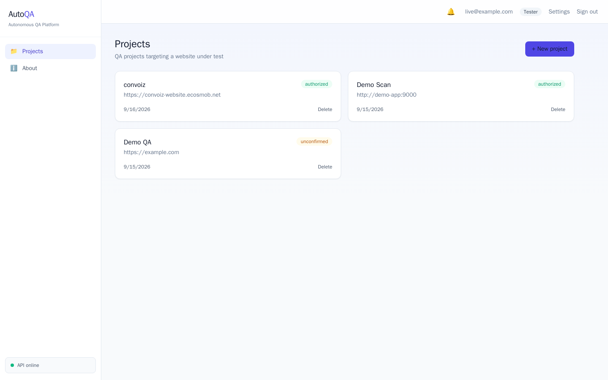

---

## 1. Overview — setup, authorization & credentials

The project header shows the target URL and the **authorized** badge. The workflow checklist on the right mirrors the pipeline order.

The **Test credentials & sign-in** card is where authenticated targets are configured:

- **Username / password** — used by the crawler (signs in before scanning) and by every browser test (establishes a session before steps run). Stored Fernet-encrypted, shown masked afterwards.
- **Login page URL + selectors** — with self-healing fallbacks like normal steps; a failed login reports `auth_login_failed`, not a misleading "element not found".
- **API auth** — a static token, or a token endpoint (`POST /login` → JSON path `token`); the resolved `Authorization: Bearer …` header is auto-attached to every API request.

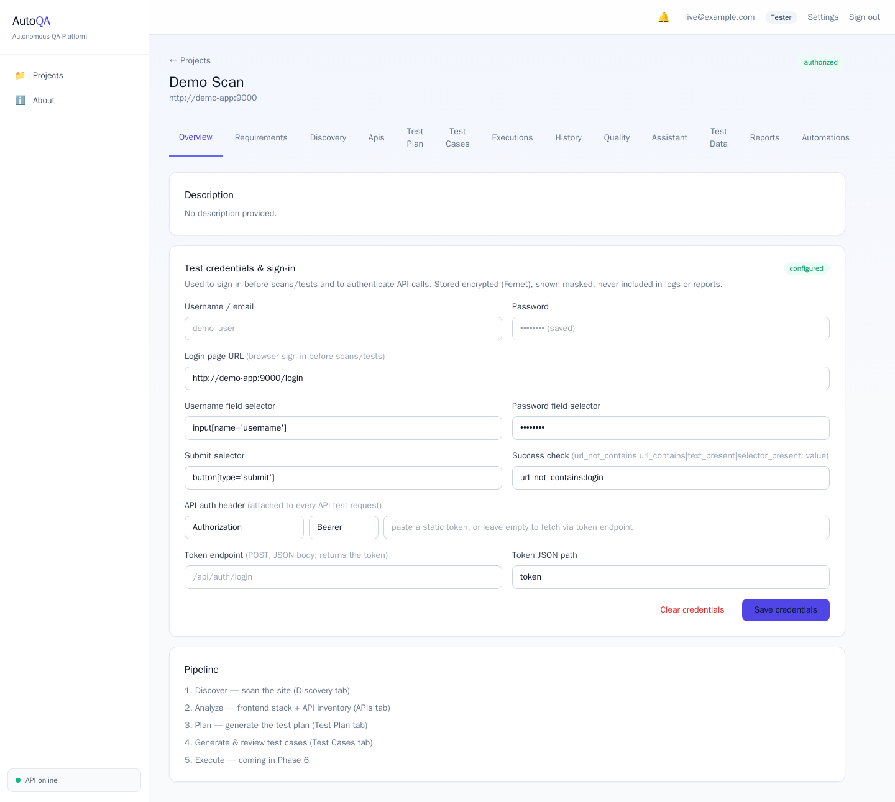

---

## 2. Requirements — from documents to test cases (PLAN V2.1)

Paste requirement text (blank-line or heading separated; `REQ-xxx:` ids optional) or upload **.md / .txt / .pdf / .docx / .xlsx / .csv / .json (Jira export)**, then hit **Generate cases for all** (or per-row). Each requirement yields a review-gated scenario set — main flow, invalid input, missing data, boundary, injection; email/reset requirements also get expired-link and link-reuse cases. Requirements that describe an API (`POST /path` style) generate API cases; the rest generate browser cases.

Generated cases carry refs derived from the requirement (`REQ-AUTH-001` → `TC-AUTH-001-001…`), appear in Test Cases for normal approval, and re-runs are idempotent — nothing duplicates.

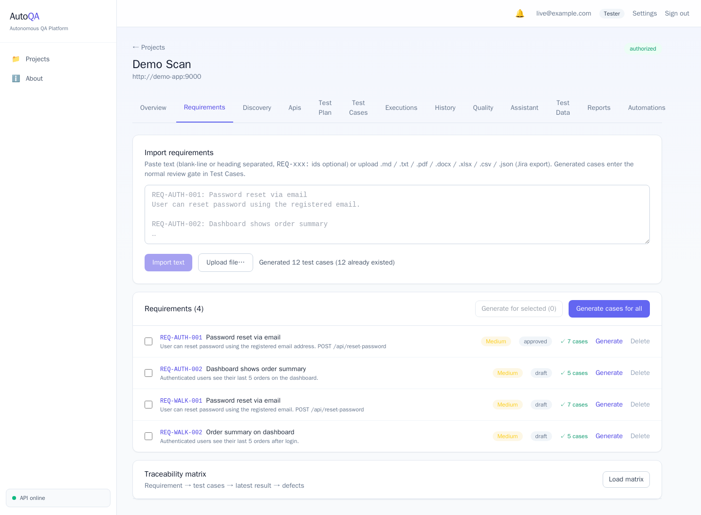

The **traceability matrix** is the payoff: requirement → cases → latest result per case (colored chips: green pass, red fail, grey never-run; a trailing `·` marks unapproved cases) → defect count, with a coverage summary strip (requirements / covered / uncovered / pass rate). This is the audit artifact enterprise QA teams need: *"every requirement has tests, and here's their latest status."*

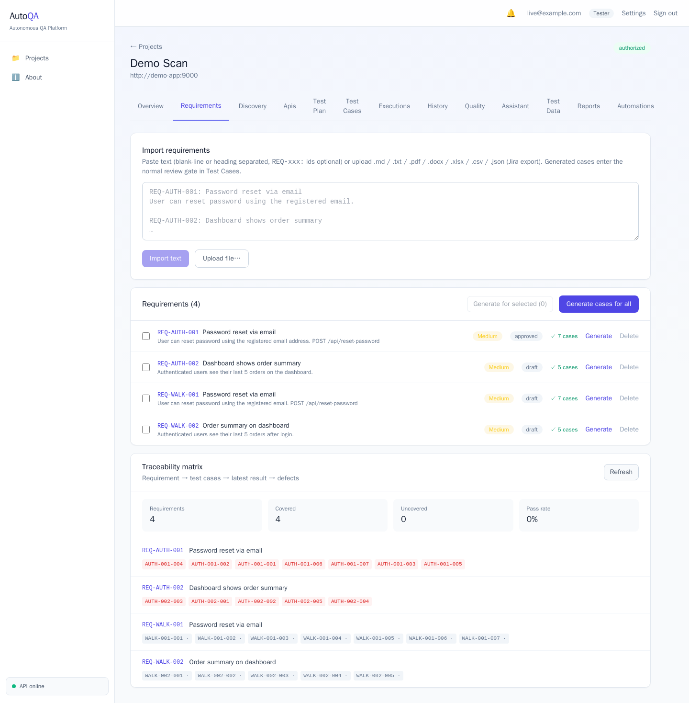

---

## 3. Discovery — crawl & sitemap

Set **Max depth** and **Max URLs**, hit **Start scan**, and the Playwright crawler renders the app like a real user (not link-scraping). Because a login URL is configured in this project, the crawler signed in first — pages behind the portal are discovered too.

The result: a sitemap with per-page component inventories (forms, buttons, inputs, modals, tables…). The status line shows the scan id, live progress, then `completed — N pages, M requests`.

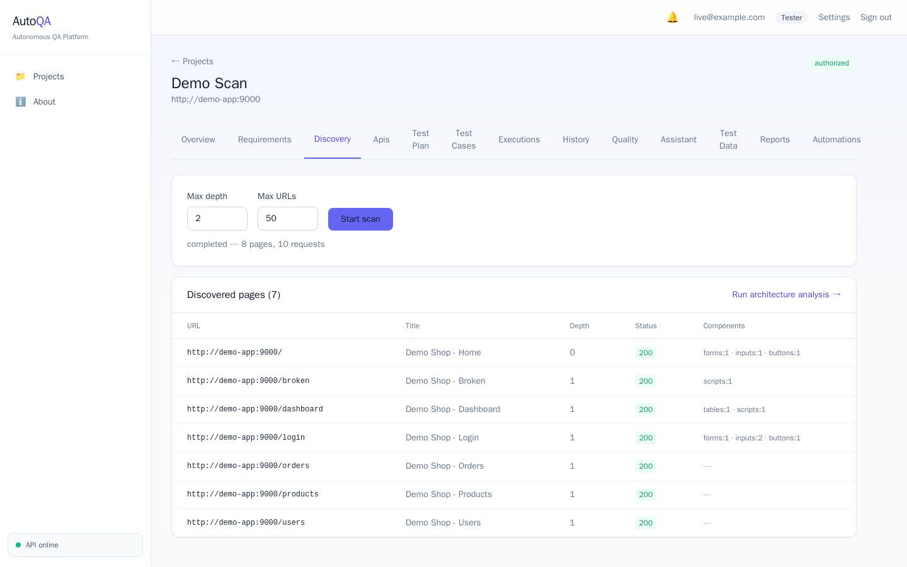

---

## 4. APIs — backend & architecture discovery

**Run architecture analysis** turns observed network traffic (+ optional OpenAPI import) into an endpoint inventory, auto-grouped by function — Auth, User, Product, Order, Payment, Reporting. Payment/checkout groups are what trigger the payment-scenario generation later. Frontend technologies are reported only with real evidence.

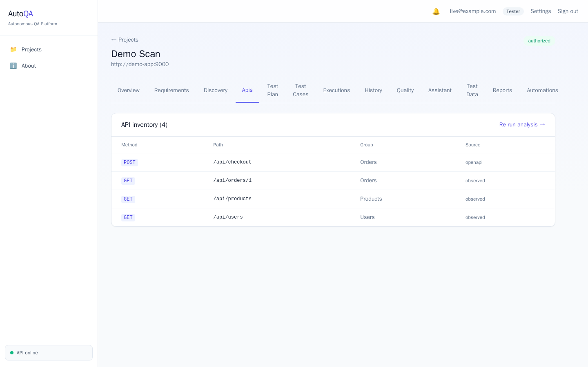

---

## 5. Test Plan — AI-generated coverage plan

One click generates a versioned plan: objective, scope, out-of-scope, components and category sections (functional, security, performance, accessibility…), each with a priority. With no LLM key configured, a deterministic heuristic plan is produced instead — the stage always yields output. **Approve** to lock scope before generating cases.

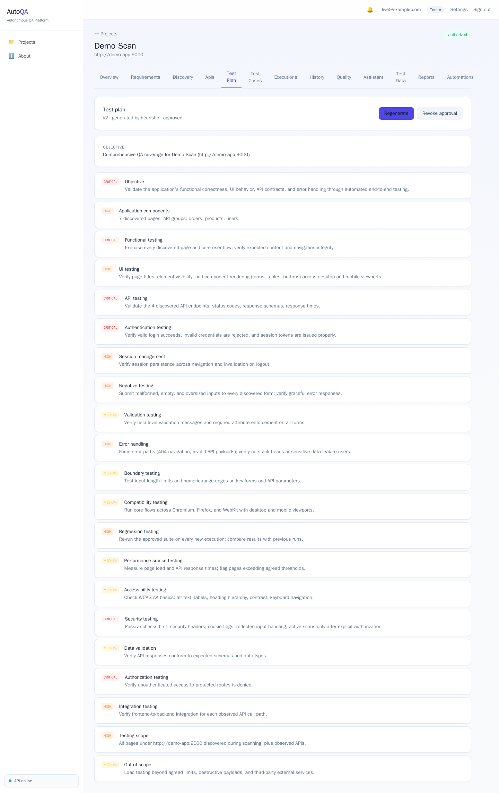

---

## 6. Test Cases — generation & review gate

Cases come with ref IDs (`TC-NAV-001`…, or `TC-AUTH-001-001…` for requirement-generated ones), module, category, priority, preconditions, steps and expected results — positive **and** negative scenarios. Login cases use `{{username}}`/`{{password}}` placeholders, never plaintext. Since discovery saw checkout endpoints, payment scenarios were added: sandbox success, declined card (`4000…0002` asserting a handled 4xx), and idempotent replay (no double-charge).

Review: approve / reject / edit / disable individually, or **Approve all**. Only approved cases execute.

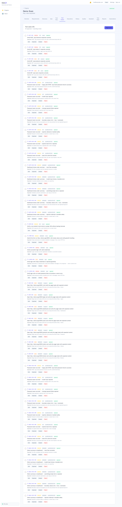

---

## 7. Test Data — environments & datasets

- **Environments** (staging, uat…): base URL + variables; runs accept an environment.
- **Datasets:** static (secrets Fernet-encrypted, masked `••••••••` everywhere) or **generated** (deterministic seeded users/emails/uuids).

Resolution order at run time: project credentials < environment variables < active datasets — so Test Data can override credentials per environment. The **resolve preview** shows exactly what a run would substitute, values masked.

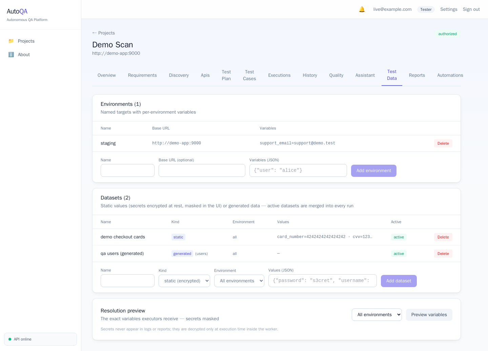

---

## 8. Executions — run control & live dashboard

**▶ Start run** dispatches approved cases to Celery workers (browser + API). The live page shows counters (Total / Running / Passed / Failed / Skipped), progress, and timestamped step logs over WebSocket — no refresh needed.

Browser cases signed in first (the auth flow from stage 1); API cases carried the auto-attached Bearer header. Failed selectors self-healed where possible, recorded in evidence.

Live, mid-run:

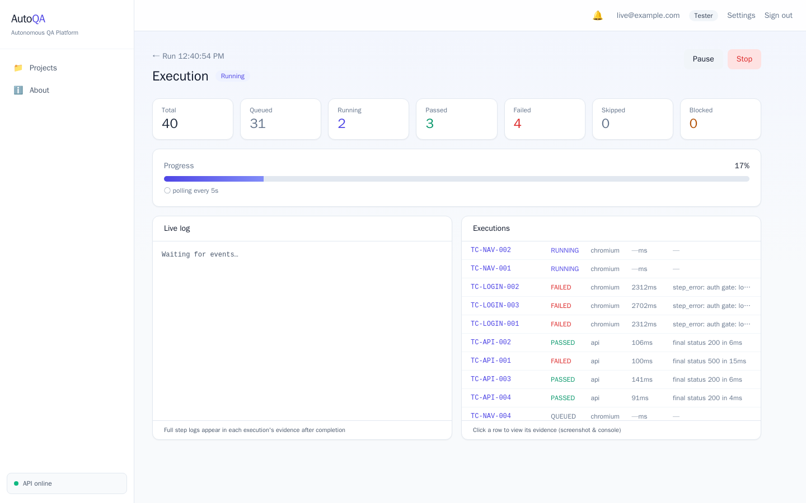

Completed (demo-app is deliberately flawed, so failures are expected — each carries a screenshot + evidence bundle):

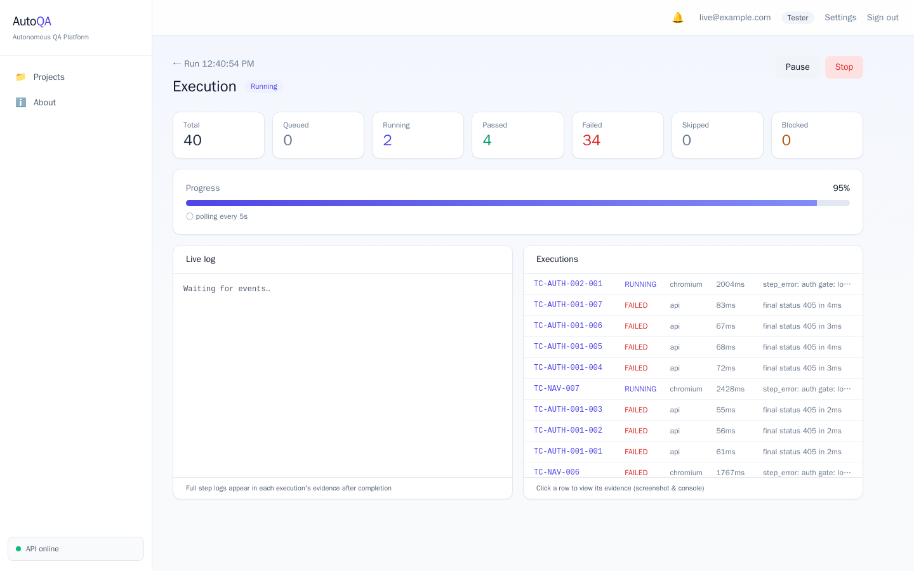

---

## 9. History — trends & run comparison

Pick any two runs as base and target; **Compare** diffs them: new failures, resolved failures, persistent failures, new/removed tests, duration changes and performance (p95) deltas. This is how you prove "this release fixed X but regressed Y".

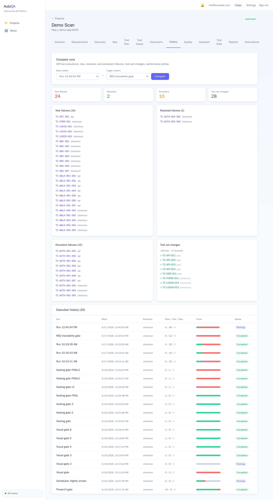

---

## 10. Quality — accessibility, performance & security

- **Accessibility (WCAG):** browser audit per page — labels, alt text, headings, contrast-related rules — with violation counts by severity.
- **Performance (smoke load):** configurable VUs/RPS/duration → p50/p90/p95/p99, throughput, error rate; threshold breaches flagged. Guardrails cap requests to protect production targets.
- **Security** scans run from the API in three tiers (Passive → Safe Active → Authorized Full, the last gated behind explicit re-confirmation) on an isolated worker; findings feed the reports stage.

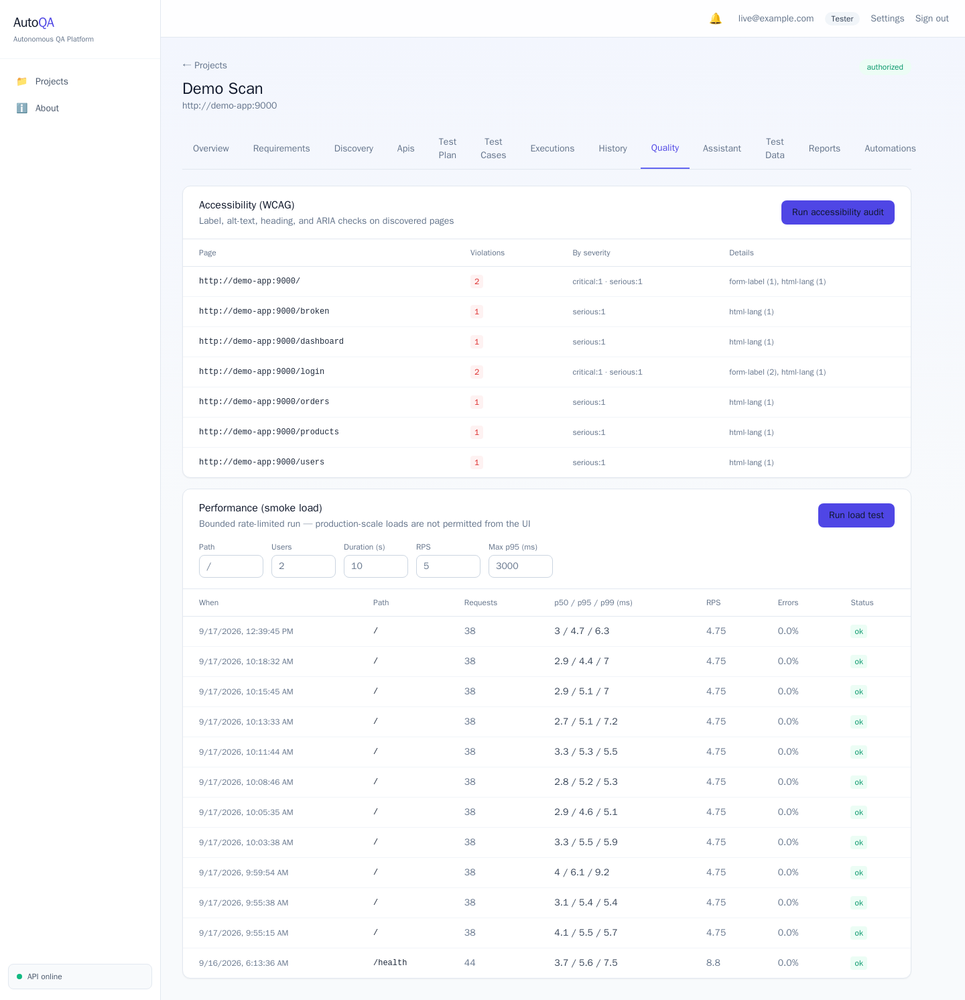

---

## 11. Assistant — grounded AI copilot

Ask in plain language: "why did tests fail?", "which module has the most defects?", "give me a QA summary". Answers are computed from **real database queries first**; the LLM (if configured in Settings → AI) may only rephrase the verified answer, under a hard ~30s budget — so gateway timeouts can't recur. Works with no LLM at all.

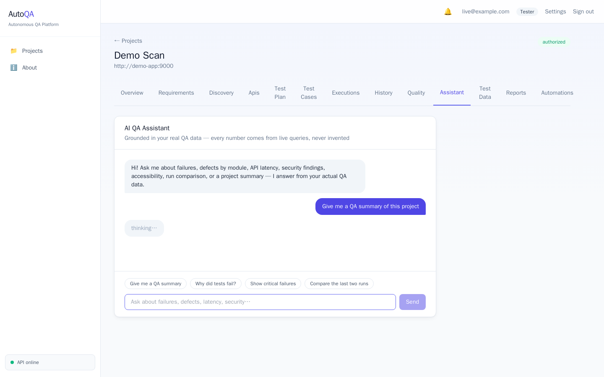

---

## 12. Reports — professional deliverables

Generate **CSV / Excel / PDF / HTML / JSON** for the whole project or a single run. Generation is a background job on the `reports` queue; download when `completed`. Contents: executive summary, environment/app info, test plan, execution stats, per-case results, defects, security/a11y/perf results, embedded failure screenshots (HTML/PDF) and evidence-grounded recommendations.

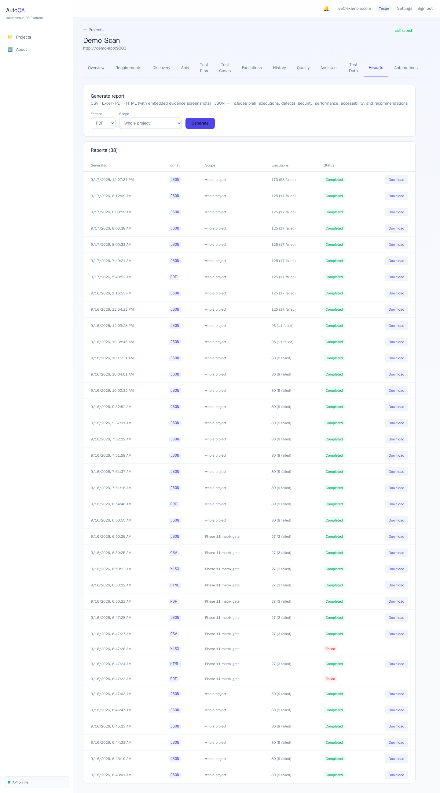

---

## 13. Automations — continuous testing

- **Schedules:** cron regressions (UTC, e.g. `0 2 * * *`) with browser selection, environment and parallelism; beat dispatches due schedules every minute; **Run now** for one-offs.
- **Webhooks:** HMAC-SHA256-signed (`X-AutoQA-Signature`) Slack-compatible notifications on run completion; URLs encrypted at rest.
- **Flaky detection:** instability score from history → stable / suspect / flaky.
- **Visual testing:** per case × browser baselines, pixel-diff with red-overlay artifact, approve-as-new-baseline loop.
- **Recorder import:** paste Playwright `codegen` output → reviewable test case. Self-healing locators back every execution.

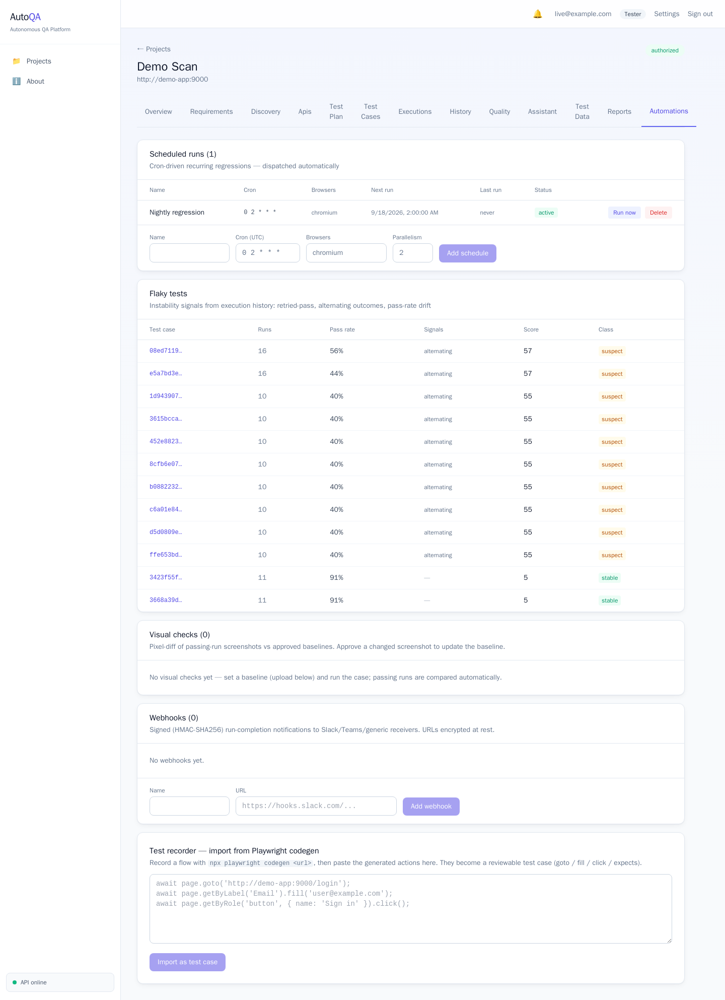

---

## The loop

Stages 1–7 are the core loop you run per release (requirements → … → executions); 8–13 make QA continuous. Typical cadence:

1. Set up once: credentials, requirements, environments, datasets, schedule, webhook.
2. Per release: **Requirements** (for new features) → **Discovery** (if the app changed) → **Executions** (or let the schedule fire) → **History** compare against the last good run.
3. Share: **Reports** for stakeholders; the **traceability matrix** for compliance; **Assistant** for quick answers; **Automations** keeps it all running nightly.

For the stage semantics in more depth, see the [stage-by-stage guide in the README](../README.md#stage-by-stage-guide-project-tabs). For credentials, auth flows and payment testing, see [Authenticated targets](../README.md#authenticated-targets-credentials-portals--payment-flows); for the requirements stage API, see [Requirements & Traceability](../README.md#requirements--traceability-plan-v21).
